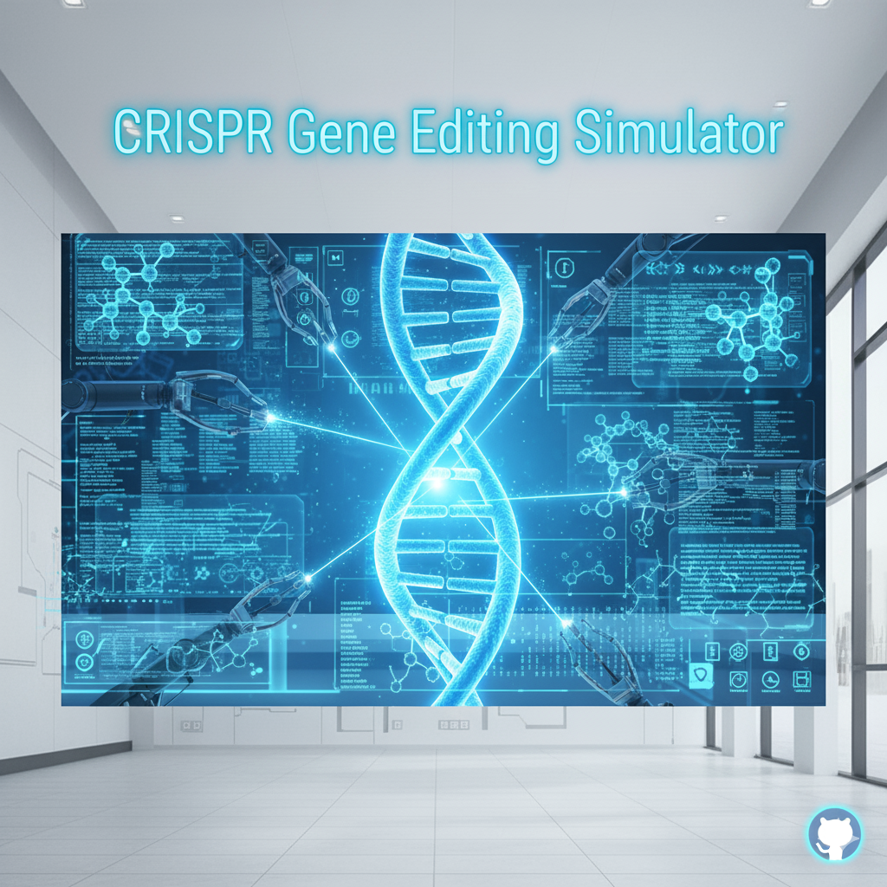

<p align="center">
  
</p>

# 🧬 CRISPR Gene Editing Simulator

**CRISPR Gene Editing Simulator** is an interactive web-based demo built with **Python (Flask)**, **HTML**, **CSS**, and **JavaScript**.  
It visually demonstrates how **CRISPR-Cas9** can locate and replace specific gene sequences within DNA, helping users understand the basic concept of gene editing in an engaging, animated way.

---

##  Features

✅ **DNA Animation** — Visualizes the DNA double helix in real-time using JavaScript canvas  
✅ **CRISPR Simulation** — Enter DNA, guide RNA, and replacement sequences to simulate edits  
✅ **Interactive Web App** — Powered by Flask backend and modern frontend styling  
✅ **Educational Focus** — Designed for science exhibitions, biology fairs, and classroom demos  

---

##  Folder Structure

```

CRISPR_Simulator/
│
├── app.py
├── templates/
│   └── index.html
└── static/
├── style.css
└── script.js

````

---

##  Setup Instructions

### 1️⃣ Install Python dependencies
Make sure Python and pip are installed, then open a terminal in the project folder and run:

```bash
pip install flask
````

### 2️⃣ Run the Flask app

```bash
python app.py
```

### 3️⃣ Open in browser

Visit → [http://127.0.0.1:5000](http://127.0.0.1:5000)

You’ll see the CRISPR simulator interface where you can enter:

* **Original DNA Sequence:** `ATGCGTACCGTACG`
* **Guide RNA Sequence (Target):** `CGTA`
* **Replacement Sequence:** `GCTA`

The system will simulate the CRISPR edit and visualize the new sequence!

---

##  Example

**Input:**

```
Original DNA: ATGCGTACCGTACG
Guide RNA: CGTA
Replacement: TTAA
```

**Output:**

```
Edited DNA: ATGTTAAACCGTTAA
```

The animation updates to reflect the change in the gene structure.

---

##  Technologies Used

| Component | Technology                    |
| --------- | ----------------------------- |
| Backend   | Python (Flask)                |
| Frontend  | HTML5, CSS3, JavaScript       |
| Animation | Canvas API                    |
| Styling   | Poppins Font, CSS Transitions |

---

##  Future Enhancements

* 🧪 Add mutation visualization for single nucleotide changes
* 🎨 Integrate 3D double-helix rendering using **Three.js**
* 🧬 Use real CRISPR gene data from NCBI or Ensembl APIs

---


##  Developer

**Developed by [DHEEPAK G](https://github.com/lillibot2054)**
Researcg Scientist | Innovator | AI & Robotics Enthusiast | 
---

##  License

This project is released under the **MIT License** , free for educational and research use.

---

<p align="center">
  ⭐ If you like this project, give it a star on GitHub! ⭐  
</p>
```

